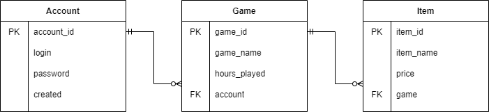

# Lab 1. Getting started with basic PostrgeSQL functionality

## Gaming field

Website devoted to selling game accounts.

## Graphical ER model

| Relation | Attribute | Data type |
|----------|-----------|-----------|
| account | `account_id` - unqiue identifier `login` - account login `password` - account password `created` - date, when account was created | Integer String String Date  |
game | `game_id` - unique identifier `game_name` - name of the game `hours_played` - time, spent in game `account` - ID of related account. | Integer String Integer Integer  |
item |`item_id` - unique identifier `item_name` - name of the item `price` - real cost of item (in USD) `game` - ID of related game | Integer String Numeric Integer  |
